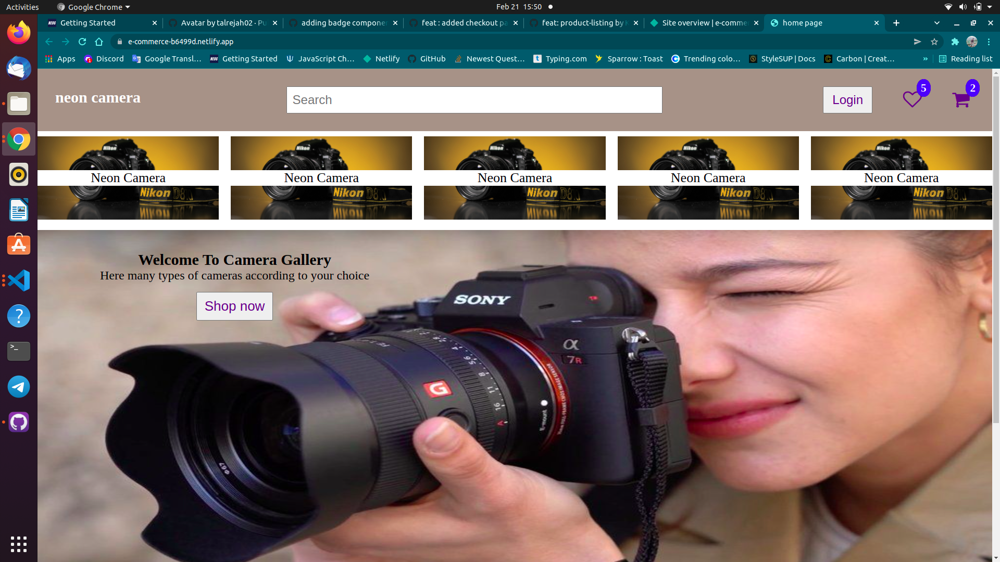

# E-commerce-macro-project
 
This is a simple E-commerce website created using just html and css

##Technologies Used :
- HTML
- CSS

## Available Componants:
- [Home Page](https://e-commerce-b6499d.netlify.app/index.html)
- [Product-lising page](https://e-commerce-b6499d.netlify.app/product-list-1/product-list.html)
- [Wishlist](https://e-commerce-b6499d.netlify.app/wish-list/wish-list.html)
- [My Cart Page](https://e-commerce-b6499d.netlify.app/my-cart/my-cart.html)
- [Login Page](https://e-commerce-b6499d.netlify.app/login-layout/ligin.html)
- [Sign-up Page](https://e-commerce-b6499d.netlify.app/signup-layout/signup.html)
- Add Log-out button

##Home Page Preview :

